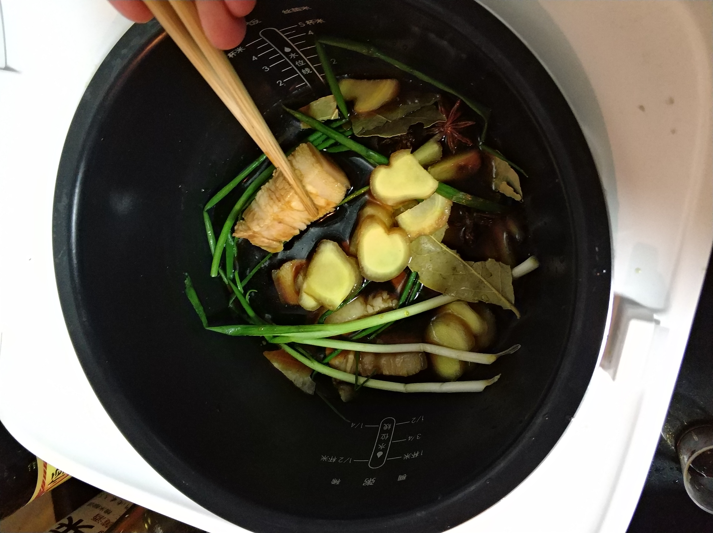
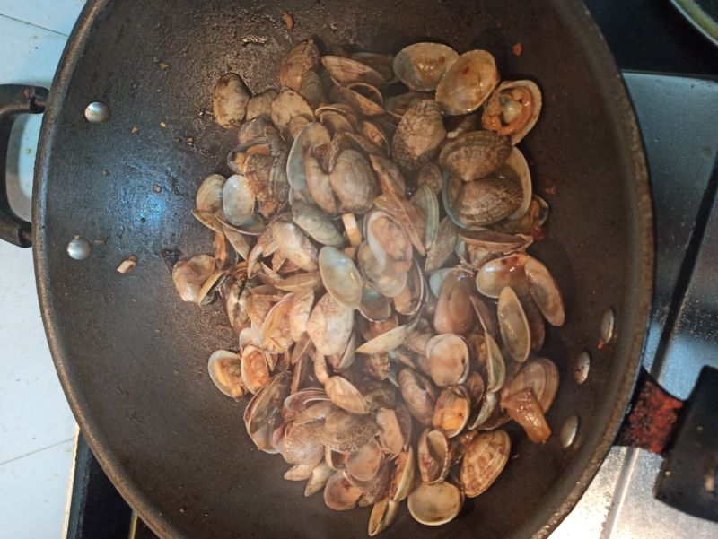
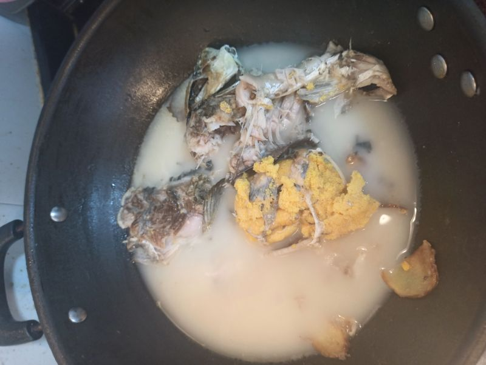
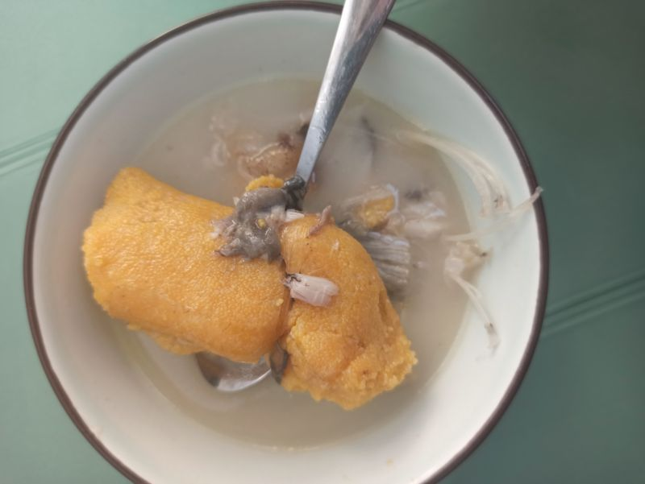
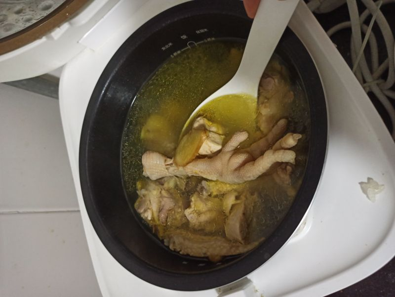
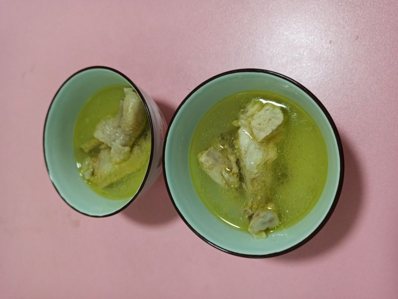

**Xiang Wang @ 2018-07-22 18:29:06**

# 注意事项
* 基础信息
小勺: 1g 中勺: 1.5g 大勺: 3g
* 小米电饭锅内胆:
    * 内胆: 920g
    * 加水到4刻度: 2320g, 920g内胆 + 1400g水

# [烤箱食谱](./烤箱.md)
### [蛋挞](./蛋挞.md)
### 烤红薯
#### 第二次做
* 180摄氏度，30分钟。可以吃但是还缺一点点
* 200摄氏度，5分钟。有点焦了
* 180摄氏度，5分钟
### [焦糖布丁](./焦糖布丁.md)

# 菜单
## 蒸煮
煮包子，水到1刻度
* 开口叉烧包子： 10分钟
* 生肉包子： 13分钟
* 汤包： 12分钟, 15分钟也可以
* 大汤包： 13分钟
* 汤圆500g

蒸沙地红薯： 20分钟不熟

## 主食
### [皮蛋瘦肉粥](./皮蛋瘦肉粥.md)
### 紫薯小米粥
编号|紫薯|小米|水|备注
---|---|---|---|---
1|243g|半盒|粥稀 1/2米|1小时，好吃
2|300g 去皮切块|3/4盒|粥稀 1/2米多一点|1小时，好吃. 够4人吃

### 小米粥
半盒小米，加水做二分之一稠，做出来的小米粥太稠了，只能喝一次

### [韭菜鸡蛋饼](./韭菜鸡蛋饼.md)

## 菜
### 肉菜
* [糖醋排骨](./糖醋排骨.md)
* [红烧肉](./红烧肉.md)

* [可乐鸡翅](./可乐鸡翅.md)
* [红烧鸡翅](./红烧鸡翅.md)
* [红烧鸡腿](./红烧鸡腿.md)
* [卤鸡爪](./卤鸡爪.md)
* [卤猪蹄](./卤猪蹄.md)
* [香滑卤鸡腿](./香滑卤鸡腿.md)
* [爆炒花甲](./爆炒花甲.md)

### 汤类
* [黄豆猪蹄汤](./黄豆猪蹄汤.md)
* [冬瓜排骨汤](./冬瓜排骨汤.md)
* [番茄鸡蛋汤](./番茄鸡蛋汤.md)
* [鲫鱼汤](./鲫鱼汤.md)

* [炖鸡汤](./炖鸡汤.md)

### 荤素搭配
* [土豆牛腩](./土豆牛腩.md)
* [番茄炖牛腩](./番茄炖牛腩.md)
* [土豆咖喱鸡块](./土豆咖喱鸡块.md)
* [农家小炒肉](./农家小炒肉.md)
* [青椒炒鸡蛋](./青椒炒鸡蛋.md)
* [番茄炒蛋](./番茄炒蛋.md)

### 素菜
* [炒茄子](./炒茄子.md)
* [炒西芹](./炒西芹.md)
* [香菇生菜](./香菇生菜.md)
* [干锅花菜](./干锅花菜.md)

## 煮粽子
购买五芳斋的100g鲜肉粽子x2，煮15分钟即可,保温4分钟后好吃
